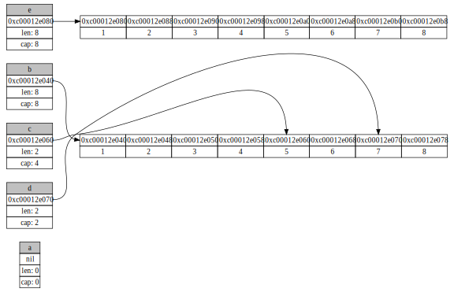

# slicegraph
Slice graph uses graphviz in order to make you understand what happens underneath your slices.

## How to use that?

```go
package main

import (
	"bytes"
	"fmt"

	"github.com/jbszczepaniak/slicegraph/slicegraph"
)

func main() {
	var a []int
	b := []int{1, 2, 3, 4, 5, 6, 7, 8}
	c := b[4:6]
	d := b[6:]
	e := make([]int, len(b))
	copy(e, b)

	var by []byte
	buff := bytes.NewBuffer(by)
	err := slicegraph.AsGraph(map[string][]int{
		"a": a,
		"b": b,
		"c": c,
		"d": d,
		"e": e,
	}, buff)
	if err != nil {
		panic(err)
	}

	fmt.Println(buff)
}
```
Run above program and redirect the output to the file

```sh
go run main.go > example.svg
open example.svg
```

Examine the results 🕵🏼‍♂️

